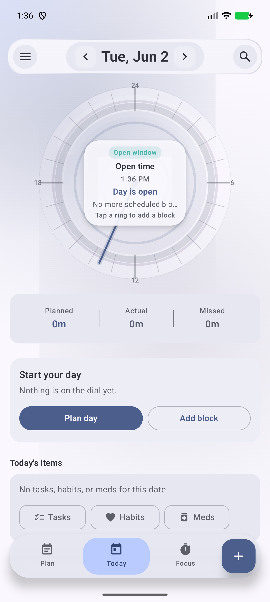
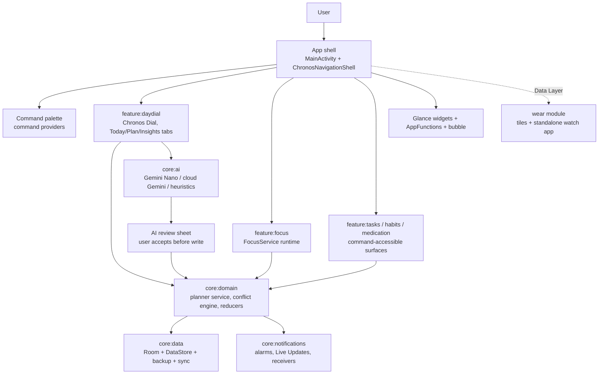
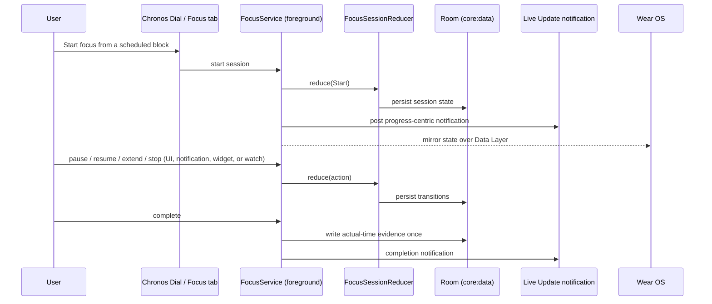

# ChronosFlow

<p align="center">
  
</p>

ChronosFlow is a dial-first Android day planner built around the Chronos Dial: a 24-hour circular view of the day where calendar events, planned time blocks, tasks, habits, medication reminders, and focus sessions all render as arcs on one surface. The app is a multi-module Jetpack Compose project with Hilt dependency injection, a Room data layer, on-device AI planning through ML Kit GenAI (Gemini Nano), and a companion Wear OS app.

The product direction is intentionally narrow: Today, Plan, Focus, and a global command palette form the primary experience. Standalone task, habit, medication, and review screens remain compiled and reachable through commands, expanded layouts, and feature flags, but the dial is the spine of the app. The minimal product contract lives in [`README_MINIMAL.md`](README_MINIMAL.md) and the long-horizon plan in [`ROADMAP.md`](ROADMAP.md).

## What It Does

- Renders the full day as a three-ring radial planner with a live now hand, current/next block context, free-time summary, and conflict indicators.
- Plans the day with validated time blocks, task scheduling, free-time detection, conflict detection and repair, locked calendar commitments, and undo/redo planner commands.
- Runs focus sessions from scheduled blocks through a foreground service that survives UI closure, with Android 16 Live Update progress notifications and Wear OS mirroring.
- Suggests plans with on-device Gemini Nano (ML Kit GenAI Prompt API on AICore), optional cloud Gemini, and local heuristics — every AI suggestion is staged for explicit user review before it touches the plan.
- Tracks tasks, habits, medication doses, mood/energy check-ins, and a daily planned-versus-actual review loop.
- Extends to home screen Glance widgets, Wear OS tiles and a standalone watch app, app shortcuts, an experimental dial bubble, and agent app-control through AndroidX AppFunctions.

## App Features

### Chronos Dial

- 24-hour radial planner with three semantic rings: calendar events and fixed commitments, planned time blocks, and task/habit/medication markers.
- Center summary for the current block, next block, planned time, free time, and conflicts, plus a current-time hand.
- Tap, drag, resize, lock, and edit time blocks directly on the dial with ring-aware hit testing and haptic cues (`feature/daydial/dial/ChronosDialInteractionEngine.kt`).
- Calendar read/write integration with auto-sync and import semantics for fixed commitments.
- Day templates for reusable day blueprints.

### Day Planning

- Planner service with command-pattern mutations, undo/redo history, and deterministic conflict detection before save (`core/domain/planner/`).
- Free-time calculation, gap-fill planning, and conflict repair UI.
- Task-to-time-block scheduling with recurrence rules, reminder rules, checklists, attachments, and task-to-task connections.
- Locked blocks for commitments that planning must work around.

### Focus Engine

- Focus sessions start from a scheduled block and run in a special-use foreground service (`feature/focus/FocusService.kt`) that owns its notification and survives process death.
- Pause, resume, extend, stop, and complete actions drive a persisted session state machine (`core/domain/planner/FocusSessionReducer.kt`); completion writes actual-time evidence exactly once.
- Android 16 Live Update / promoted progress notifications with a renderer fallback for devices without Live Update support (`core/notifications/LiveUpdateRenderer.kt`).
- Focus timer ring UI, mood-accented theming, distraction notes, and focus history.

### Tasks, Habits, And Medication

- Tasks with priorities, due dates, subtasks/checklists, recurrence, contact connections, file attachments, and focus-session launch.
- Daily and weekly habits with flexible targets, habit windows, streak charts, consistency tracking, and missed-habit repair suggestions.
- Medication plans with schedules, exact reminders where justified, dose acknowledgement, missed-dose follow-up, refill tracking, adherence charts, and safety-profile notes. ChronosFlow tracks and reminds; it does not provide medical advice.
- Mood and energy check-ins feed an energy-correlation engine that informs deep-work suggestions.

### Review And Insights

- Daily review calculator compares planned versus actual time, surfaces missed blocks, and captures improvement notes (`core/domain/planner/DailyReviewCalculator.kt`).
- Insights tab with execution score, period summaries, category breakdowns, and recommendations; a weekly review complements the daily loop.

### Command Palette And Launcher

- Global command palette in the app shell (`core/ui/components/CommandPalette.kt`) with per-feature command providers for day dial, focus, tasks, habits, medication, and quick create.
- Commands respect sensitive-area locks and confirmation gates rather than bypassing them.
- Speech input support and notification deep links route into the same navigation graph.

### AI-Assisted Planning

- Three-tier model strategy in `core/ai/genai/`: ML Kit GenAI Prompt API running Gemini Nano on AICore, explicit cloud Gemini fallback when the user enables it (key via `local.properties`), and local planning heuristics when neither is available.
- Planning flows include generate-a-day, repair an overloaded plan, deep-work window detection, missed-habit rescheduling, plan explanation, and a conversational assistant.
- Every suggestion is staged in a review sheet (`feature/daydial/ui/AiReviewSheet.kt`) with per-suggestion Accept/Reject/Modify and bulk Apply All/Dismiss All — no autonomous AI writes.
- ML Kit text tools (summarization, proofreading, rewriting) back text-assist rows in forms.
- Semantic planning index built on AndroidX AppSearch for on-device retrieval over planning context.
- Device support for Gemini Nano is not universal; readiness is surfaced in AI settings and documented in [`docs/gemini-nano-support.md`](docs/gemini-nano-support.md).

### Notifications And Alarms

- Inexact scheduling is preferred for soft nudges and habit reminders; `SCHEDULE_EXACT_ALARM` is reserved for user-specified precise reminders, medication, and focus check-ins, with fallback behavior when exact alarms are unavailable (`core/domain/model/ExactAlarmPolicy.kt`).
- Boot, timezone-change, time-set, and package-replaced receivers plus a WorkManager reconcile worker keep pending alarms consistent (`core/notifications/PendingAlarmReconciler.kt`, `ReminderReconcileWorker.kt`).
- Notification action receivers for task completion, habit marking, and dose acknowledgement, with privacy redaction for sensitive content.

### Widgets, Wear OS, And System Surfaces

- Glance home screen widgets: Focus controls, Today's Schedule agenda, Tasks, Habits, and Medication, with actionable buttons and a background refresh worker (`app/src/main/java/com/chronosflow/widget/`).
- Standalone Wear OS app (`wear/`) with Compose for Wear OS Material 3, a day-dial ring, focus screen, and phone handoff via `chronosflow://open`.
- Wear tiles for Today and Habits; focus state, day summaries, and theme are mirrored over the Wearable Data Layer, and watch-originated actions replay through phone-side use cases.
- AndroidX AppFunctions expose app-control functions to system agents (`app/src/main/java/com/chronosflow/appfunctions/ChronosAppFunctions.kt`).
- Experimental dial bubble activity and app shortcuts.

### Security, Privacy, And Data Protection

- Biometric app lock with session control and sensitive-area gating (`core/data/security/`, `core/ui/security/`).
- Optional SQLCipher-encrypted Room database with a plaintext-to-encrypted migrator (`core/data/ChronosSecureDatabaseProvider.kt`).
- Privacy preferences gate cloud AI usage; notification content is redacted for sensitive areas.
- Portable backup codec, repository, and scheduled backup worker plus data export (`core/data/backup/`).
- Cross-device sync scaffolding through a Firestore-backed remote sync gateway and sync worker (`core/data/sync/`).

## Project Diagram



## Focus Session Flow



## Repository Map

```text
.
|-- app/                      # App shell: MainActivity, navigation, widgets, AppFunctions, onboarding, app lock
|-- core/ai/                  # AI planners, GenAI gateways (Nano/cloud/heuristics), semantic index
|-- core/data/                # Room database, DAOs, entities, DataStore, backup, sync, security
|-- core/domain/              # Pure domain models, planner service, conflict/free-time engines, repositories
|-- core/notifications/       # Alarm scheduling, receivers, Live Updates, reminder reconciliation
|-- core/ui/                  # Design system: theme, glass surfaces, form kit, command palette, motion
|-- feature/daydial/          # Chronos Dial, Today/Plan/Focus-planner/Insights tabs, AI review sheet
|-- feature/focus/            # Focus foreground service, session runtime, wear bridge
|-- feature/tasks/            # Task screen, form sheet, attachments, connections, command provider
|-- feature/habits/           # Habit screen, recurrence editor, streak chart, command provider
|-- feature/goals/            # Goals screen, progress tracking, linked tasks/habits/blocks
|-- feature/medication/       # Medication screen, adherence chart, plan notes, command provider
|-- wear/                     # Standalone Wear OS app, tiles, data-layer listeners
|-- benchmark/                # Macrobenchmarks, startup benchmark, baseline profile generator
|-- docs/                     # Development, Gemini Nano support, product contract, design notes
|-- scripts/                  # JBR Gradle helper, Android 17 smoke, memory budget smoke, benchmark helpers
|-- README_MINIMAL.md         # Minimal product contract (MVP scope and acceptance criteria)
|-- ROADMAP.md                # Long-horizon implementation roadmap
`-- APP_DESCRIPTION.md        # Store-style app description
```

## Main Subsystems

| Area | Primary Files | Notes |
| --- | --- | --- |
| App shell | `app/.../MainActivity.kt`, `app/.../navigation/ChronosNavigationShell.kt`, `ChronosNavGraph.kt`, `ChronosRoute.kt` | Owns adaptive navigation, shell destinations (Plan, Today, Focus primary; Tasks/Habits/Meds/Review on expanded layouts behind feature flags), and notification routing. |
| Chronos Dial | `feature/daydial/ChronosDial.kt`, `dial/ChronosDialInteractionEngine.kt`, `DayDialViewModel.kt`, `delegate/*` | Renders the three-ring dial and coordinates block, focus, AI, reminder, and review delegates. |
| Planner domain | `core/domain/planner/PlannerService.kt`, `ConflictDetectionEngine.kt`, `FreeTimeCalculator.kt`, `PlannerCommandHistory.kt`, `FocusSessionReducer.kt` | Pure scheduling rules, command-pattern mutations with undo/redo, conflict and free-time math. |
| Persistence | `core/data/ChronosDatabase.kt`, `dao/*`, `model/*Entity.kt`, `datastore/ChronosPreferencesDataSource.kt` | Room schema for plans, blocks, tasks, habits, medication, focus sessions, check-ins, and reviews; DataStore preferences. |
| AI planning | `core/ai/ChronosAIPlanner.kt`, `genai/MlKitGeminiNanoGateway.kt`, `genai/CloudGeminiGatewayImpl.kt`, `genai/LocalPlanningHeuristics.kt`, `genai/GenAiAssistCoordinator.kt` | Model routing, prompt building, response parsing, and suggestion staging. |
| Notifications | `core/notifications/AlarmScheduler.kt`, `AlarmDeliveryCoordinator.kt`, `LiveUpdateGateway.kt`, `FocusNotificationManager.kt` | Exact/inexact alarm policy, delivery, Live Updates, and action receivers. |
| Design system | `core/ui/theme/ChronosTheme.kt`, `theme/ChronosFrostedGlass.kt`, `components/ChronosFormBottomSheet.kt`, `components/CommandPalette.kt` | Material 3 theming, Haze frosted-glass chrome, shared form kit, and the palette. |
| Focus runtime | `feature/focus/FocusService.kt`, `FocusSessionRuntime.kt`, `WearFocusBridge.kt` | Foreground session execution, logging, widget dispatch, and watch mirroring. |
| System surfaces | `app/.../widget/*`, `app/.../appfunctions/ChronosAppFunctions.kt`, `wear/*` | Glance widgets, agent app-control, Wear tiles and standalone app. |
| Benchmarks | `benchmark/.../ChronosMacrobenchmark.kt`, `StartupBenchmark.kt`, `BaselineProfileGenerator.kt` | Startup and interaction macrobenchmarks plus baseline profile generation. |

## Prerequisites

- Android Studio (current stable) or a standalone Android SDK with `compileSdk 37`
- JDK 17 (the project is configured for Android Studio's bundled JBR; `scripts/gradlew-jbr.ps1` wraps Gradle with it on Windows)
- An Android device or emulator on API 26+ (`minSdk 26`, `targetSdk 37`)
- Optional: a Wear OS device or emulator for the `:wear` module
- Optional: a Gemini API key for cloud planning fallback

## Setup

1. Copy `local.properties.example` to `local.properties` and set `sdk.dir`.
2. Optionally add `GEMINI_API_KEY=...` (from Google AI Studio) to `local.properties` to enable cloud Gemini planning when the privacy mode allows cloud use. Never commit `local.properties`.

## Build And Run

Assemble and install the debug app:

```powershell
.\gradlew.bat :app:assembleDebug
```

On machines without `java` on `PATH`:

```powershell
.\scripts\gradlew-jbr.ps1 :app:assembleDebug --no-daemon
```

Debug installs use `adb install -r` semantics so an existing install is preserved (see `scripts/install-debug-preserve.ps1`).

Build the Wear OS app:

```powershell
.\gradlew.bat :wear:assembleDebug
```

## Verification

Run unit tests:

```powershell
.\gradlew.bat test --no-daemon
```

Run the full non-emulator CI path — module isolation builds, unit tests, benchmark assembly, and test APK assembly:

```powershell
.\gradlew.bat chronosCiCheck --no-daemon
```

Run macrobenchmarks against a connected device:

```powershell
.\gradlew.bat :benchmark:connectedCheck
```

Code coverage is wired through Kover for the owned logic modules (`:core:ai`, `:core:domain`, `:feature:focus`, `:wear`). Additional smoke helpers live in `scripts/` (`android17-smoke.ps1`, `android-memory-budget-smoke.ps1`, `physical-benchmark.ps1`). See [`docs/development.md`](docs/development.md) for the full local verification guide.

## Important Implementation Notes

- The Gradle module graph is `:app`, `:benchmark`, `:core:{ai,data,domain,notifications,ui}`, `:feature:{daydial,focus,tasks,habits,goals,medication}`, and `:wear` (`settings.gradle.kts`).
- `core/domain` stays free of Android persistence concerns; `core/data` owns Room entities, DAOs, mappers, and repositories behind domain repository interfaces.
- AI never writes autonomously: all model output flows through suggestion staging and the `AiReviewSheet` before any planner mutation.
- `FocusService` runs as a `specialUse` foreground service whose subtype is declared as an active focus session timer; focus state recovery after process death is part of the product contract.
- Exact alarms are policy-gated; the reminder stack reconciles after boot, timezone changes, and permission-state changes.
- Habits, medication, and review surfaces are feature-flag gated (`ChronosFeatureFlags`) and parked from compact navigation until their dial handoff is proven.
- The frosted-glass shell chrome is built on Haze; shared glass and backdrop primitives live in `:core:ui`.

## Core Technologies

- Kotlin 2.2.21, Android Gradle Plugin 9.2.1, KSP
- Jetpack Compose (BOM 2026.05) with Material 3, adaptive layouts, and window size classes
- Hilt for dependency injection
- Room 2.8 (with optional SQLCipher encryption) and DataStore Preferences
- Navigation Compose, Lifecycle, WorkManager, Biometric
- ML Kit GenAI (Prompt, Summarization, Proofreading, Rewriting) on AICore for Gemini Nano, plus the Google Generative AI client for cloud fallback
- AndroidX AppSearch, AppFunctions, Glance app widgets
- Wear OS: Compose for Wear OS Material 3, Tiles/ProtoLayout, Wearable Data Layer, remote interactions
- Firebase Firestore (sync gateway scaffolding)
- Haze frosted glass, Material icons extended
- Testing: JUnit 4, MockK, Turbine, Robolectric, Roborazzi, Compose UI tests, Espresso, Macrobenchmark, Kover coverage
